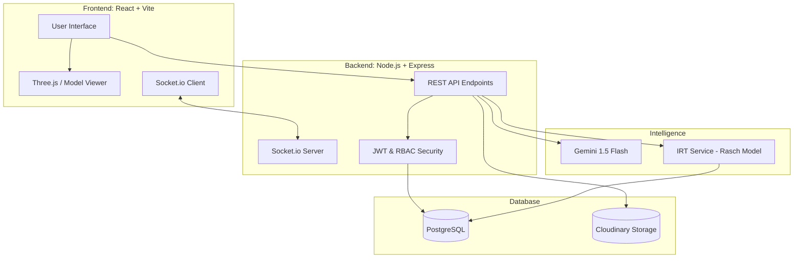

<div align="center">
  
  
  # 🌌 ARKON v3.0: AI-Integrated Computer Architecture Lab
  
  [](https://opensource.org/licenses/MIT)
  [](https://reactjs.org/)
  [](https://deepmind.google/technologies/gemini/)
  [](https://lidm.kemdikbud.go.id/)

  **ARKON** adalah ekosistem pendidikan cerdas yang mentransformasi pembelajaran Arsitektur Komputer melalui sinergi **3D Simulation**, **Generative AI**, dan **Psychometric Analytics**.

  [Demo Video](#) • [Slide Presentasi](#) • [Laporan Teknis](./docs/TECHNICAL_REPORT.md)
</div>

---

## 🚀 Scientific Foundation: IRT Rasch Model (1PL)
ARKON bukan sekadar platform kuis biasa. Kami mengimplementasikan **Item Response Theory (IRT)** menggunakan **Rasch Model (1PL)** untuk memberikan estimasi kemampuan mahasiswa yang akurat secara matematis.

- **Adaptive Testing**: Tingkat kesulitan soal menyesuaikan dengan probabilitas keberhasilan mahasiswa ($\theta$).
- **Newton-Raphson MLE**: Estimasi kemampuan ($\theta$) dihitung secara real-time di backend menggunakan metode *Maximum Likelihood*.
- **Pedagogical Insight**: Memberikan data objektif bagi dosen mengenai distribusi tingkat kesulitan soal dan penguasaan materi per individu.

---

## 🏗️ Technical Architecture



## 🛡️ Security & Architecture Hardening
Project ini telah melalui tahap penguatan keamanan dan refaktor modular untuk stabilitas tingkat kompetisi:

- **Modular Architecture**: Ekstraksi logika ke dalam `services/` (AI, IRT), `config/` (Database), dan `middleware/` (Auth).
- **Strict Authorization**: Penegakan kepemilikan data (Ownership-based Access) menggunakan `req.user.id` dari JWT token untuk mencegah *cross-account data manipulation*.
- **AI Resilience**: Implementasi *model rotation* dan *retry logic* pada Gemini API untuk menangani limit kuota dan kegagalan handshake secara otomatis.
- **Robust PDF Parsing**: Integrasi `pdf-parse` yang fleksibel untuk menangani berbagai struktur dokumen akademik.

---

## 🌿 Kontribusi terhadap SDGs
ARKON berkomitmen mendukung **Agenda 2030 PBB** untuk Pembangunan Berkelanjutan, khususnya:

- **SDG 4: Quality Education**: Menghilangkan hambatan finansial untuk mengakses laboratorium hardware komputer yang mahal melalui simulasi 3D & AR yang presisi.
- **SDG 9: Industry, Innovation, and Infrastructure**: Memajukan inovasi digital dalam pendidikan vokasi untuk menyiapkan tenaga kerja yang kompeten di era industri 4.0.

---

## 📸 Dashboard Preview
| AI Learning Workspace | 3D Assembly Simulator |
| :---: | :---: |
|  |  |

---

## 🛠️ Tech Stack & Implementation
- **Frontend**: React 18, TailwindCSS, Framer Motion, Lucide Icons, Recharts, Three.js
- **3D/AR**: Three.js, Google Model Viewer (WebXR), AR Lab
- **Backend**: Node.js, Express 5, PostgreSQL (node-postgres), Socket.io
- **AI Integration**: Google Generative AI SDK (Gemini 2.0 Flash)
- **Analytics**: Custom IRT Math Engine (Rasch Model 1PL, Newton-Raphson MLE)
- **DevOps**: Docker, docker-compose (dev + prod), Health Check Endpoints

---

## 🔒 Security Measures
ARKON mengimplementasikan keamanan berlapis:

| Layer | Implementation | File |
|-------|---------------|------|
| **Rate Limiting** | 5 req/menit pada endpoint kritis (coins, AI) | `ai.routes.js`, `gamification.routes.js` |
| **Input Sanitization** | Server-side validation, type checking, length limits | `middleware/sanitize.js` |
| **JWT Auth** | Access token + Refresh token, bcrypt password hashing | `middleware/auth.js` |
| **RBAC** | Role-based access (mahasiswa/dosen), ownership validation | `middleware/auth.js` |
| **Helmet** | CSP headers, XSS protection, CORS configuration | `server.js` |
| **SQL Injection Prevention** | Parameterized queries ($1, $2), no string concatenation | All routes |

---

## 🗺️ LIDM 2027 Development Roadmap
Pengembangan ARKON berorientasi pada kompetisi ITDP LIDM 2027 dengan 4 fase kritis:
1. **Phase 1: Production Hardening** — Security audit (Token revocation, file upload), Performance (Redis, DB Indexes), Core gaps.
2. **Phase 2: Pilot & Konten** — Ekosistem Multi-tenant, Ekspansi bank soal (200+ soal IRT), Uji coba ke PT Pilot.
3. **Phase 3: LIDM Differentiators** — Adaptive Learning Path via AI, LMS Integration (Moodle), PWA offline-first.
4. **Phase 4: Polish & LIDM Submit** — Load Testing, Dokumentasi empiris N-Gain $\ge 0.30$, Finalisasi proposal.

---

## 🧪 Testing
```bash
cd arch-ai-backend && npm test
```

| Test Suite | Coverage | Description |
|-----------|----------|-------------|
| `irt.service.test.js` | Rasch probability, Newton-Raphson convergence, item information, adaptive selection | Core IRT engine |
| `ngain.service.test.js` | N-Gain calculation, Hake classification, batch class analysis, effectiveness | Analytics service |
| `auth.test.js` | Register, login, forgot password integration | Authentication flow |

---

## 🐳 Deployment

### Development
```bash
docker compose up -d --build
```

### Production
```bash
docker compose -f docker-compose.prod.yml up -d --build
```

**Production differences**: No volume mounts, `NODE_ENV=production`, restart policies, resource limits (CPU/RAM), healthchecks on all services.

### Health Check
```
GET /api/health
```
Returns: database status, Gemini API status, app version, uptime, memory usage.

---

## 🏁 Quick Start
1. **Clone**: `git clone https://github.com/arkon-edu/arkon.git`
2. **Backend**: 
   - `cd arch-ai-backend && npm install`
   - Configure `.env` (JWT_SECRET, REFRESH_SECRET, DB credentials, GEMINI_API_KEY)
   - `npm run dev`
3. **Frontend**:
   - `npm install && npm run dev`
4. **Docker** (recommended):
   - `docker compose up -d --build`

---

<div align="center">
  <p><b>ARKON Team</b> — Inovasi untuk Pendidikan Indonesia 🇮🇩</p>
  [](https://lidm.kemdikbud.go.id/)
</div>

