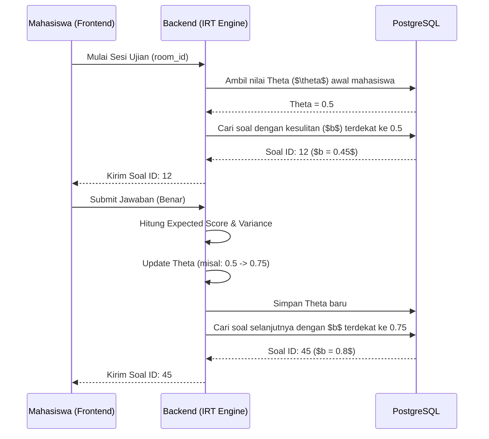
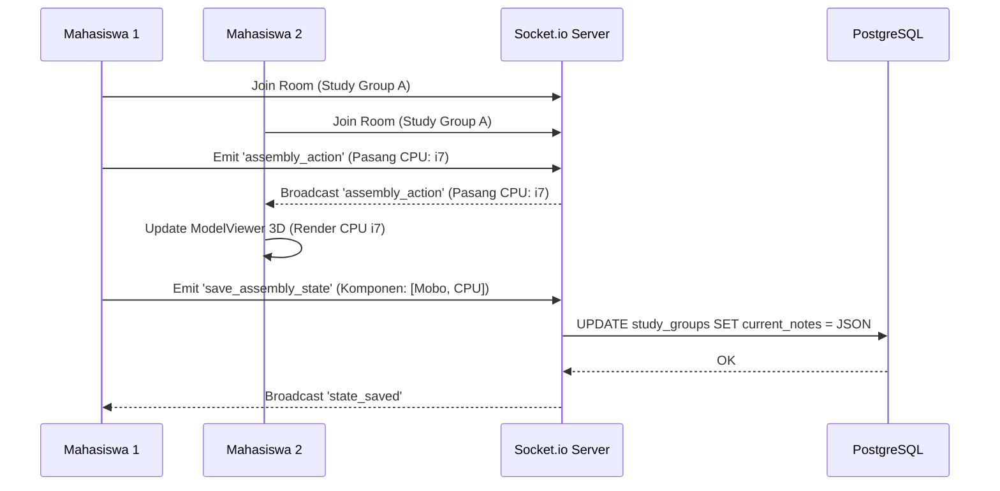

# ARKON v2.0 - Technical Report & Architecture Document
## Lomba Inovasi Digital Mahasiswa (LIDM) 2027

### 1. Executive Summary
ARKON adalah platform e-learning adaptif berbasis *Room-Based Learning* yang dirancang khusus untuk mata kuliah Arsitektur Komputer. Menggabungkan teknologi simulasi 3D interaktif (WebXR), analitik psikometrik menggunakan Item Response Theory (Rasch Model 1-PL), serta fitur kolaborasi real-time. Platform ini memberikan alternatif yang efektif dan murah dibandingkan laboratorium perangkat keras fisik yang mahal.

### 2. Alignment dengan Sustainable Development Goals (SDGs)
- **SDG 4 (Quality Education):** Menyediakan akses pembelajaran interaktif yang setara bagi mahasiswa di berbagai daerah tanpa terhalang biaya pengadaan laboratorium fisik.
- **SDG 9 (Industry, Innovation, and Infrastructure):** Memanfaatkan teknologi inovatif (AI dan 3D Web) untuk membangun infrastruktur pendidikan masa depan.
- **SDG 10 (Reduced Inequalities):** Menurunkan biaya pembelajaran praktikum komputer hingga 90%, mengurangi kesenjangan antara universitas di kota besar dengan daerah berkembang.

### 3. Architecture & Tech Stack
**Frontend:**
- React.js + Vite (Single Page Application)
- TailwindCSS (Styling & Responsive Design)
- Three.js & @google/model-viewer (3D rendering & WebXR AR Mode)
- Socket.io-client (Real-time events)

**Backend:**
- Node.js + Express.js
- PostgreSQL (Local & Cloud via pg-pool)
- Socket.io (WebSocket Server untuk Live Class, Quiz, dan Study Group)
- Google Gemini 2.0 Flash (Generative AI untuk Adaptive Hint & Analytics)

**DevOps & Security:**
- Docker Compose (Multi-container orchestration)
- Nginx (Reverse Proxy)
- JWT Authentication + HttpOnly Refresh Tokens
- Helmet (CSP, XSS Protection) + Rate Limiting
- bcryptjs (Password Hashing)

### 4. Installation & Deployment Guide

#### 4.1. Requirements
- Node.js v20+
- PostgreSQL 14+
- Docker & Docker Compose (Untuk Production)

#### 4.2. Local Development (Staging)
1. Clone repository ARKON.
2. Setup environment variables di dalam `.env` root dan `.env` backend.
3. Inisialisasi Database:
   ```bash
   cd arch-ai-backend
   npm install
   node migrations/run_migration.js
   node utils/seed_demo_data_realistic.js
   ```
4. Jalankan backend: `npm run dev` (Berjalan di port 3000)
5. Jalankan frontend: Buka tab baru, jalankan `npm run dev` di root directory.

#### 4.3. Production Deployment
Deployment menggunakan arsitektur *production-grade* via Docker Compose:
```bash
docker-compose -f docker-compose.prod.yml up -d --build
```
Ini akan otomatis menjalankan PostgreSQL, Node.js Backend, dan Nginx (port 80). Pastikan volume ter-mount dengan baik.

---

### 5. Algoritma Inti: Item Response Theory (Rasch Model 1-PL)

ARKON tidak menggunakan penilaian persentase konvensional, melainkan pendekatan probabilitas probabilistik melalui **Item Response Theory (IRT)**.

#### 5.1. Rumus Probabilitas
Probabilitas mahasiswa ($i$) menjawab benar pada soal ($j$) dinyatakan dengan rumus logistik:
$$ P(X_{ij} = 1 | \theta_i, b_j) = \frac{e^{(\theta_i - b_j)}}{1 + e^{(\theta_i - b_j)}} $$
Dimana:
- $\theta_i$ = Tingkat kemampuan mahasiswa laten (Theta).
- $b_j$ = Tingkat kesulitan soal (Difficulty Index).

#### 5.2. Pembaruan $\theta$ (Maximum Likelihood Estimation - MLE)
Secara real-time, kemampuan mahasiswa ($\theta$) diperbarui menggunakan iterasi Newton-Raphson:
1. Hitung Expected Score ($E$) menggunakan rumus probabilitas di atas untuk setiap soal yang dijawab.
2. Hitung Variance ($V$) dengan rumus $V = P \times (1 - P)$.
3. Update Theta: $\theta_{new} = \theta_{old} + \frac{\text{Skor Aktual} - E}{V}$.
4. Iterasi berhenti setelah konvergensi ($\Delta \theta < 0.01$).

#### 5.3. Sequence Diagram: Alur Ujian Adaptif IRT



---

### 6. Arsitektur Real-time: Live Class & 3D Assembly

#### 6.1. Sequence Diagram: Kolaborasi 3D Assembly Sandbox



### 7. Keamanan dan Validasi (Security)
Platform dilengkapi standar keamanan tinggi untuk lingkungan pendidikan:
- **Rate Limiting:** Mencegah serangan Brute Force pada endpoint autentikasi dan pencetakan koin (100 request/15 menit).
- **XSS & CSP:** Menerapkan Helmet untuk memblokir script injection eksternal.
- **SQL Injection Prevention:** Penggunaan *Parameterized Queries* murni melalui `pg-pool`.
- **RBAC (Role-Based Access Control):** Pemisahan ketat *endpoint* Dosen dan Mahasiswa melalui token verifikasi.

---

### 8. LIDM 2027 Development Roadmap
Pengembangan ARKON v3.0 difokuskan untuk mencapai skor 100/100 pada ITDP LIDM 2027 dengan jadwal eksekusi sebagai berikut:

- **Phase 1: Production Hardening (Jun – Agt 2026)**
  Berfokus pada keamanan (Token Revocation, Socket Auth), peningkatan performa (Redis, DB Indexes), dan *core gaps* (PDF Report Export, Theta UI). Target: platform yang stabil untuk *deployment* produksi.
- **Phase 2: Pilot & Konten (Sep – Nov 2026)**
  Ekspansi multi-tenant (Institution ID), penambahan bank soal hingga 200+ butir untuk validitas IRT, serta uji coba pilot ke minimal 1 perguruan tinggi.
- **Phase 3: LIDM Differentiators (Des 2026 – Feb 2027)**
  Integrasi kecerdasan buatan dalam bentuk *Adaptive Learning Path*, *Personalized Insight*, serta fitur LMS (Moodle Sync) dan PWA Service Worker.
- **Phase 4: Polish & LIDM Submit (Mar – Mei 2027)**
  Fase pengujian intensif (Load Testing k6 hingga 50 *concurrent users*, Integration Tests) dan finalisasi dokumentasi proposal empiris (N-Gain aktual $\ge 0.30$) untuk di-submit ke sistem LIDM.
